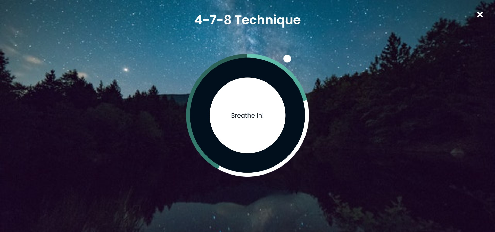
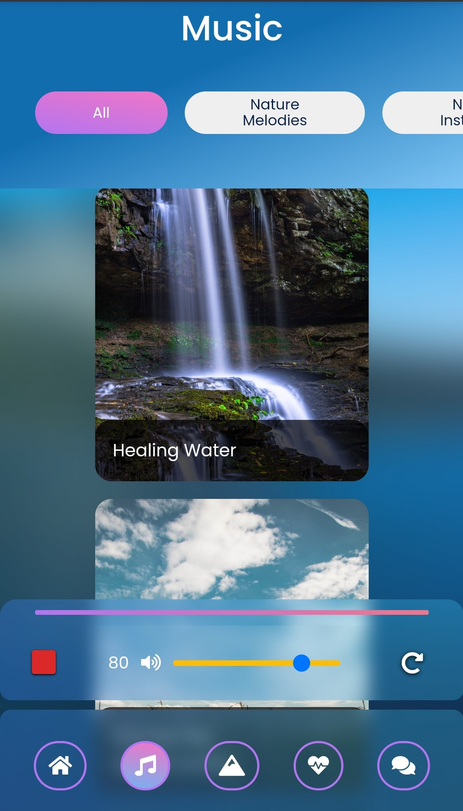

# [TranquilMind Meditation App](https://umatter.netlify.app/ "U Matter")

### [**TranquilMind**](https://umatter.netlify.app/ "U Matter") is a meditation and relaxation app that designed to take you some moment to relax and breathe. TranquilMind mission is to help you find your inner peace and improve your mental health.

## **How can we help you?**

- Music to help you focus and relax.
- Nature scenes with sounds to enjoy while relaxing.
- Guides you through the breathing exercise.
- A voice assistant that always here to talk and to listen.

---

> ### Meditation and concentration are the way to a life of serenity.

> “Look deep into nature, and then you will understand everything better.” — Albert Einstein

### U Matter Breathing Exercises Preview

> “Breathe. Let go. And remind yourself that this very moment is the only one you know you have for sure.” — Oprah Winfrey

> “When you don’t talk, there’s a lot of stuff that ends up not getting said.” — Catherine Gilbert Murdock

> “There are many ways to relax. Sometimes you might enhance that relaxation by listening to mellow music. At other times, you might use the stress and sing and dance to an upbeat tune.” — Jay Winner

## Visit TranquilMind[here](https://umatter.netlify.app/ "TranquilMind")

---

#### powered by HTML5, CSS3 and Vanilla JavaScript
